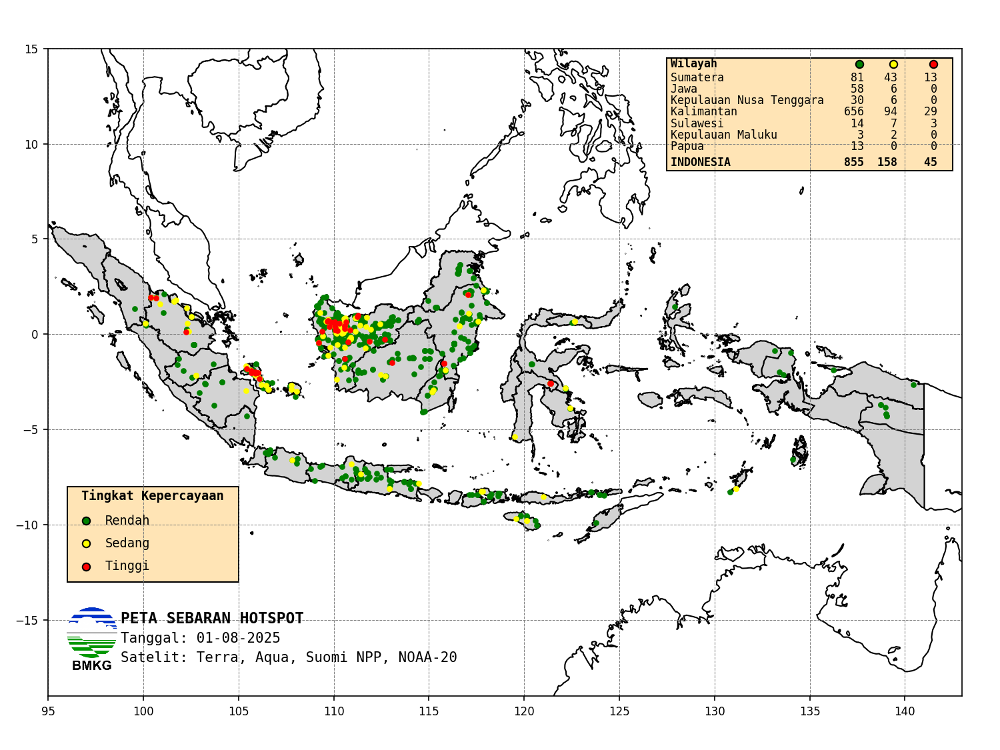

# Indonesian Hotspot Analysis

This repository provides a comprehensive suite of Python scripts and associated data files for the analysis of hotspot data across Indonesia. Forest and land fires are a significant environmental concern in Indonesia, and monitoring hotspot activity is crucial for early warning, prevention, and mitigation efforts. The scripts in this repository are designed to automate the process of downloading, processing, and visualizing hotspot data from NASA's Fire Information for Resource Management System (FIRMS), offering valuable insights into the spatial and temporal distribution of fire activity throughout the archipelago. This project aims to provide a clear and reproducible workflow for hotspot analysis, which can be utilized by researchers, government agencies, and other stakeholders.

## Data

The repository includes a variety of data files that are essential for the analysis. These files provide the raw hotspot data as well as the necessary geospatial information for mapping and visualization.

* **`archived_hotspot_idn.csv`**: This CSV file contains a historical record of hotspot data for Indonesia. This archived data is crucial for understanding long-term trends and patterns in fire activity.
* **`hotspot_by_municipality.csv`**: This file presents hotspot data that has been aggregated at the municipality (Kabupaten/Kota) level. This granular level of detail is useful for local-level analysis and targeted interventions.
* **`hotspot_by_province.csv`**: This CSV file contains hotspot data aggregated by province. This provides a broader, regional overview of fire activity and is useful for provincial-level planning and resource allocation.
* **`indonesia_38prov.geojson`**: A GeoJSON file containing the geographic boundaries of Indonesia's 38 provinces. This file is used for creating choropleth maps and other spatial visualizations at the provincial level.
* **`indonesia_kabkota_38prov.geojson`**: This GeoJSON file provides the boundaries of Indonesia's municipalities. It is used for detailed mapping at the local level.
* **Shapefiles**: The `shp` directory contains shapefiles that provide the geographic boundaries for Indonesia's 38 provinces and a world map with Indonesia excluded. Shapefiles are a standard format for geospatial data and are used in various GIS software for more complex spatial analysis.

## Scripts

The `code` directory contains a set of Python scripts that form the core of the analysis pipeline. These scripts are designed to be run in sequence to perform the complete workflow from data acquisition to final processing.

* **`extract-total-hotspot.py`**: This script is used to extract the total number of hotspots from the `archived_hotspot_idn.csv` file. This is a preliminary step to get a baseline understanding of the historical data.
* **`get-hotspot.py`**: This script is responsible for downloading the latest hotspot data from the NASA FIRMS API. It ensures that the analysis is based on the most up-to-date information available.
* **`preprocess_hotspot.py`**: After downloading the raw data, this script performs essential preprocessing steps. This includes cleaning the data, handling missing values, and formatting the data into a consistent and usable structure for further analysis.
* **`process.py`**: This is the main processing script. It takes the preprocessed hotspot data and performs the core analysis. This includes aggregating the data by province and municipality, joining it with the geospatial data, and generating the final output files and visualizations.

## Images

The `image` directory contains visual assets related to the project.

* **`logo_bmkg.png`**: This is the official logo of the Indonesian Agency for Meteorology, Climatology, and Geophysics (BMKG), a key government agency involved in monitoring environmental conditions in Indonesia.
* **`update_hotspot.png`**: This image provides a visual representation of the hotspot data update process, which can be useful for presentations or reports.

## License

This project is licensed under the GNU General Public License v3.0. This means you are free to use, modify, and distribute the code, provided you adhere to the terms of the license. For more details, please see the `LICENSE` file in the repository.

